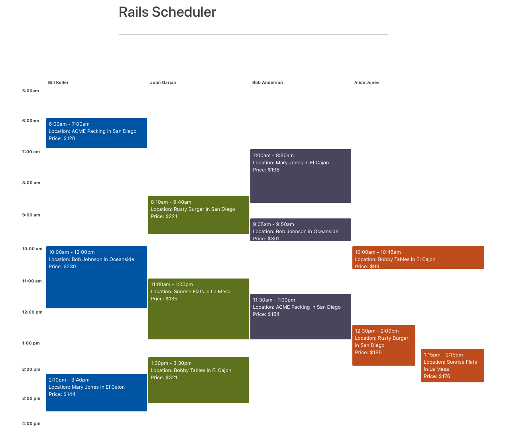

# Ruby on Rails Technician Schedule

## Set-up and Installing

1. Download repo

2. Copy and paste bootstrap and bulma gem into Gemfile:

- gem 'bootstrap', '~> 5.0.0.alpha1'
- gem "bulma-rails", "~> 0.9.0"

and bundle install

3. Create DB instance
* rails db:create

CSV files should already be included in repo. Can add data into datebase by running the following Rake Task with
* bundle exec rake import

Running on: 

* Ruby version
2.7

* Rails version
6.0

4. Start server with
* Rails s

## Approach and learnings
I first approached this project by drawing out the databases and thinking through the db relationships. I primarly focused on getting my data to appear on the DOM as needed and then worked on the timetable view. 

With the data, I first set-up all my templates with the dbs, models and views and then inserted my data. I utilized the ruby -c environment and rails db to test query to retrieve the correct data. I then created my rake task to import all of my csv data into my DB. 

After I got my data displaying as needed (with each Technician with their own workorders and the location for each workorder) I then throught through how to display the data with a "daily" schedule view of one hour intervals. This was the most challenging part of this project for me since I haven't created many different views using Rails. I thought about using other gems (full calendar or simple calendar) or even other frameworks (Vue and jQuery) but ran into a lot of issues with webpacker and wasn't able to find much documentation with Rails 6. 

Impovements for the future would to have the popup correctly display and know which appointment it is referencing to display the time until the next work order as well as improving the user interface look. 

